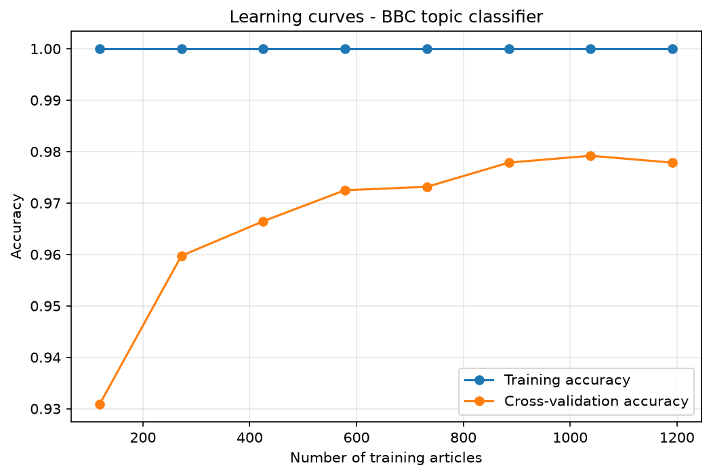

# NLP Scraper - News Intelligence Platform


An end-to-end pipeline that scrapes live news articles and enriches each one
with four analyses: which organizations it mentions, what topic it covers,
how positive or negative it reads, and whether a company in it appears close
to environmental-disaster language.

Built as part of the 01Edu AI Specialization curriculum.

## TL;DR

- **300 BBC articles** scraped through the site's XML news sitemap, stored
  idempotently (re-running never duplicates an article).
- **Topic classifier:** TF-IDF + LinearSVC, **98.5% accuracy** on 735
  held-out articles (requirement: > 95%), per-class F1 between 0.97 and 0.99.
- **Scandal detection:** word embeddings and cosine similarity flag the 10
  articles whose company-naming sentences sit closest to environmental-disaster
  phrases. Unsupervised, so it ranks likelihood rather than proving anything.
- **One output table:** `results/enhanced_news.csv`, 300 rows x 10 columns.

## What it does

The platform runs in two independent stages that communicate only through
files on disk.

**Stage 1 - Scraper** (`scraper_news.py`)
Reads BBC News' XML sitemap, keeps standard written articles (skipping live
blogs and video pages), downloads and parses each one, and stores the unique
ID, URL, date, headline and body in one CSV file per day.

**Stage 2 - NLP engine** (`nlp_enriched_news.py`)
Loads the stored articles and the trained topic model, then runs four
analyses per article:

| Analysis | Method | Trained or pre-trained | Output |
|---|---|---|---|
| Entity detection | spaCy NER (`en_core_web_md`) | Pre-trained | List of `ORG` entities |
| Topic detection | TF-IDF + LinearSVC | Trained here, on 1,490 labeled BBC articles | business / entertainment / politics / sport / tech |
| Sentiment analysis | NLTK VADER | Pre-trained | Compound score in [-1, 1] |
| Scandal detection | spaCy word vectors + cosine similarity | No training, a similarity calculation | Per-article score + Top-10 flag |

Each article is parsed by spaCy once, and that single parse serves both entity
and scandal detection.

## Pipeline

```
BBC news sitemap ──> scraper_news.py ──> data/news_YYYY-MM-DD.csv
                                              │
bbc_news_train.csv ──> results/training_model.py ──> topic_classifier.pkl
                                              │              │
                                              ▼              ▼
                                        nlp_enriched_news.py
                                              │
                                              ▼
                                   results/enhanced_news.csv
```

## Results

### Topic classifier

| Class | Precision | Recall | F1 |
|---|---|---|---|
| business | 0.97 | 0.98 | 0.97 |
| entertainment | 0.99 | 0.99 | 0.99 |
| politics | 0.97 | 0.99 | 0.98 |
| sport | 0.99 | 0.99 | 0.99 |
| tech | 1.00 | 0.97 | 0.99 |
| **Accuracy (735 held-out articles)** | | | **98.5%** |

The test file was provided pre-split and never used in training, and the
`Pipeline` ensures the TF-IDF vocabulary is learned from training data only.
With `random_state=42`, a retrain reproduces 0.9850 exactly.

### Learning curves



Cross-validation accuracy (5 folds, 8 training sizes) climbs from about 93% to
about 98% as data grows, closing most of the gap to training accuracy. The
model generalizes rather than memorizes.

### Scandal detection

The 10 flagged articles included stories mentioning United Utilities,
Southern Water, the Environment Agency, Dovestone Reservoir and the Tranmere
Oil Terminal: genuinely environment-related coverage surfaced from a general
news feed with no labeled scandal data. This is a qualitative check, not a
measured accuracy.

### Output

`results/enhanced_news.csv`, one row per article:

| Column | Content |
|---|---|
| `Unique ID` | Article identifier |
| `URL` | Source link |
| `Date scraped` | Scrape date |
| `Headline` | Article headline |
| `Body` | Article text |
| `Org` | Detected organizations |
| `Topics` | Predicted topic |
| `Sentiment` | VADER compound score |
| `Scandal_distance` | Highest keyword-to-sentence similarity |
| `Top_10` | True for the 10 highest scandal scores |

## How scandal detection works

**Embeddings.** spaCy `en_core_web_md` word vectors (300 dimensions, trained on
large web corpora) place words on a map of meaning, where "pollution" sits
close to "contamination" and far from "cricket". A sentence's vector is the
average of its word vectors. The medium model is required because the small
model ships no real vectors. The same model already performs NER, so one
model serves both tasks.

**Similarity.** Cosine similarity between the embedded disaster keywords and
every sentence that contains a detected `ORG`. Cosine compares the direction
of vectors rather than their length, so short and long sentences are compared
fairly. Values run from 0 (unrelated) to 1 (same meaning).

**Per-article score.** The maximum sentence similarity. A scandal is usually
one damning sentence inside an otherwise neutral article; an average would
dilute it, the maximum keeps it. The 10 highest-scoring articles are flagged.

**Keywords.** Multi-word, unambiguous phrases only, such as "oil spill",
"toxic waste dumping" and "groundwater pollution". Single words like "spill"
("spill the beans") or "plant" ("tomato plant") would produce false
positives.

## Design decisions

- **BBC as the source.** Its XML news sitemap makes discovery clean, and the
  topic classifier is trained on BBC text, so scraped articles match the
  training distribution.
- **Sitemap over crawling.** Reading the site's own list of article URLs is
  faster and more reliable than following links page by page.
- **One CSV per day** instead of a database. Simple, transparent and directly
  inspectable, which is all a batch pipeline needs.
- **Idempotent scraping.** Every stored URL is loaded into a set before
  scraping, so re-runs top up the dataset without duplicates. This matters
  because BBC's sitemap covers roughly 48 hours and consecutive runs overlap.
- **Pre-trained sentiment (VADER).** Labeled news sentiment data is
  expensive; a validated lexicon-based model is the practical choice.
- **Simple linear classifier.** TF-IDF + LinearSVC is the standard strong
  baseline for text classification, resists overfitting, and cleared the
  requirement comfortably, so no tuning or neural model was needed.

## Known limitations

- **Scandal detection cannot be validated.** No labeled data exists, so there
  is no accuracy figure. It ranks likelihood for a person to review; it does
  not verify that a scandal occurred.
- **NER is imperfect.** spaCy tags institutions such as museums and government
  bodies as `ORG` (they are organizations, but not companies) and makes
  occasional outright mistakes, such as tagging "T. rex" as an organization
  in an article about a fossil auction.
- **Single source, single snapshot.** All articles come from the BBC on one
  day, so the output is a snapshot rather than a trend, and outlets cannot be
  compared.
- **Scraper is BBC-specific.** The body selector depends on BBC's current page
  markup and would break if it changed.
- **Source analysis not implemented.** The optional per-day and per-company
  insights from the brief were not built; they would need several days of
  scraping.

## Project structure

```
.
├── data/
│   ├── bbc_news_train.csv       # labeled BBC dataset (training, 1,490 articles)
│   ├── bbc_news_tests.csv       # labeled BBC dataset (evaluation, 735 articles)
│   └── news_YYYY-MM-DD.csv      # scraped articles, one file per day
├── results/
│   ├── training_model.py        # trains + evaluates the topic classifier
│   ├── learning_curves.png      # overfitting diagnostic
│   └── enhanced_news.csv        # final enriched output
├── scraper_news.py              # stage 1: article scraper
├── nlp_enriched_news.py         # stage 2: NLP engine
├── topic_classifier.pkl         # trained TF-IDF + LinearSVC pipeline
└── requirements.txt             # pinned dependencies
```

## Setup

```bash
python3 -m venv .venv
source .venv/bin/activate        # Windows (Git Bash): source .venv/Scripts/activate
pip install -r requirements.txt
python -m spacy download en_core_web_md
python -c "import nltk; nltk.download('vader_lexicon'); nltk.download('punkt'); nltk.download('stopwords')"
```

On Windows, use `python` instead of `python3`.

## Usage

```bash
python scraper_news.py             # 1. fetch >= 300 articles into data/
python results/training_model.py   # 2. train and save topic_classifier.pkl
python nlp_enriched_news.py        # 3. produce results/enhanced_news.csv
```

Step 2 must run before step 3. Steps 1 and 2 are independent of each other.

## Tech stack

Python · requests · BeautifulSoup · lxml · pandas · scikit-learn · spaCy · NLTK · matplotlib
